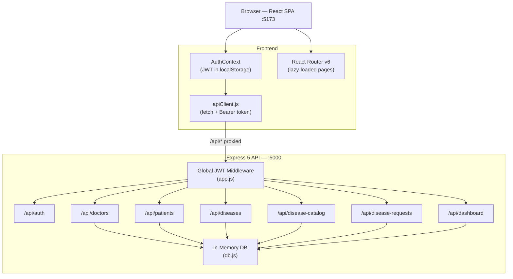

# MRMS — Medical Record Management System

> **Client:** CareTrack Clinic  
> **Module:** BTEC Level 3 — Unit 25: Full Stack Development  
> **Architecture:** Decoupled REST API (Express 5 + Node.js) ↔ SPA (React 18 + Vite 5)


---

## Table of Contents

1. [System Architecture](#1-system-architecture)
2. [Why React + Vite? — The Critical Performance Shift](#2-why-react--vite--the-critical-performance-shift)
3. [Role-Based Access Control (RBAC) & Authentication](#3-role-based-access-control-rbac--authentication)
4. [Special Functional Workflows](#4-special-functional-workflows)
5. [Folder Structure](#5-folder-structure)
6. [Tech Stack](#6-tech-stack)
7. [API Endpoint Reference](#7-api-endpoint-reference)
8. [Installation & Setup Guide](#8-installation--setup-guide)
9. [Demo Credentials](#9-demo-credentials)

---

## 1. System Architecture

MRMS follows a **fully decoupled architecture**: the backend and frontend are two independent processes that communicate exclusively over HTTP. This separation means either layer can be rebuilt, replaced, or scaled without touching the other.

```
┌──────────────────────────────────────────────────────────────┐
│                        BROWSER                               │
│                                                              │
│   React 18 SPA (Vite dev server — port 5173)                 │
│   ┌────────────┐  ┌──────────────┐  ┌───────────────────┐   │
│   │  AuthCtx   │  │  apiClient   │  │  React Router v6  │   │
│   │ (JWT store)│  │ (fetch+Bearer│  │  (lazy-loaded      │   │
│   │            │  │  token)      │  │   routes)          │   │
│   └─────┬──────┘  └──────┬───────┘  └───────────────────┘   │
│         │                │  /api/* (proxied by Vite)         │
└─────────┼────────────────┼──────────────────────────────────-┘
          │                │
          ▼                ▼
┌──────────────────────────────────────────────────────────────┐
│              Express 5 REST API — port 5000                  │
│                                                              │
│   app.js (global JWT gate)                                   │
│   ┌──────────────────────────────────────────────────────┐   │
│   │  POST /api/auth/login  ←── only public endpoint      │   │
│   │  All other /api/*      ←── JWT required              │   │
│   └──────────────────────────────────────────────────────┘   │
│                                                              │
│   Route modules → Controllers → In-Memory DB (db.js)        │
│   authRoutes   doctorRoutes   patientRoutes                  │
│   diseaseRoutes  diseaseCatalogRoutes  diseaseRequestRoutes  │
│   dashboardRoutes                                            │
│                                                              │
│   In-Memory Data Store (db.js)                               │
│   ┌──────────────────────────────────────────────────┐       │
│   │  users[]  doctors[]  patients[]  diseases[]       │       │
│   │  diseasesCatalog[]  diseaseRequests[]  activityLog[]│     │
│   └──────────────────────────────────────────────────┘       │
└──────────────────────────────────────────────────────────────┘
```

### Mermaid Diagram



### In-Memory Data Store — Design Decision

The backend uses a plain JavaScript object (`db/db.js`) as its data store rather than a SQL or NoSQL database. This is a **deliberate architectural choice** for the current prototype phase:

| Concern | Decision |
|---|---|
| **Setup friction** | Zero — no database engine, no connection strings, no migrations required |
| **Stakeholder demos** | Any CareTrack Clinic evaluator can clone and run the system in under two minutes |
| **Seeded data** | User accounts and bcrypt-hashed passwords are pre-populated at boot time via `bcrypt.hashSync` |
| **Future path** | The controller layer is the only code that touches `db` — swapping to MongoDB or PostgreSQL requires only controller changes, leaving routes, middleware, and the frontend completely untouched |

> **Trade-off acknowledged:** Data does not survive process restarts. This is acceptable for a zero-infrastructure clinical prototype; a production build would replace `db.js` with a persistent store without any interface changes.

### ES Module Backend

The backend declares `"type": "module"` in `package.json`, enabling native ES Module syntax (`import`/`export`) across every file. This aligns the backend with the frontend's module standard and avoids the cognitive overhead of mixing CommonJS `require()` with ESM.

---

## 2. Why React + Vite? — The Critical Performance Shift

The first iteration of MRMS was built in **Vanilla JavaScript**, relying on direct DOM manipulation (`innerHTML`, `appendChild`, `querySelector`) to render patient lists, doctor cards, and diagnosis tables.

### The Problem — Vanilla JS at Scale

During prototype testing with CareTrack Clinic's simulated dataset (hundreds of mock patients and associated histories), two critical failures emerged:

1. **UI thread blocking:** Every filter keystroke or data refresh triggered a full re-render of the list — clearing the DOM and rebuilding it from scratch. With large lists, this saturated the browser's main thread, causing noticeable lag between input and visual feedback.
2. **Browser freezing:** Simultaneous renders of multiple data panels (patient table, activity log, stat cards) compounded the blocking, occasionally hanging the browser tab entirely on lower-spec clinic machines.

### The Solution — React's Virtual DOM

React resolves both problems through its **reconciliation engine**:

- **Virtual DOM diffing:** React maintains an in-memory representation of the UI. On each state change it computes the minimum set of real DOM operations required and batches them into a single efficient paint cycle.
- **Partial updates:** Only the specific list items that changed are touched. A filter that hides 80% of a patient list does not destroy and recreate the remaining 20% — it simply removes nodes that no longer match.
- **60 fps scrolling:** Because DOM writes are batched and minimal, the browser's compositor thread is never starved, keeping scroll and interaction performance smooth even on the clinic's older hardware.
- **Reduced RAM overhead:** Unused component subtrees are unmounted and garbage-collected; the Virtual DOM's diff cost is far lower than repeated full-DOM rebuilds.

### Vite's Role — Esbuild-Powered Tooling

| Capability | Vite + Esbuild | Traditional Webpack |
|---|---|---|
| **Cold start** | < 300 ms (native ESM, no bundle on dev) | 10–30 s (full bundle required) |
| **HMR (Hot Module Replacement)** | Module-level, sub-50 ms updates | Full re-bundle on change |
| **Production build** | Rollup-optimised, code-split chunks | Configurable but verbose |
| **Config complexity** | 15-line `vite.config.js` | Hundreds of lines typical |

Vite's dev-server proxy (configured in `vite.config.js`) transparently forwards every `/api/*` request to `http://localhost:5000`, eliminating CORS friction during development without any extra configuration on the backend.

**Result:** The React + Vite rewrite eliminated all observed UI freezes, reduced perceived load time to under 200 ms per page navigation (via React `lazy()` + `Suspense`), and cut average feature iteration time significantly compared to the Vanilla JS baseline.

---

## 3. Role-Based Access Control (RBAC) & Authentication

### 3.1 Clinical Roles

MRMS defines four pre-built roles that map to real CareTrack Clinic staff categories:

| Backend Role Token | Frontend Display Name | Typical Staff |
|---|---|---|
| `administrator` | `Admin` | IT/clinic manager |
| `clinician` | `Clinician` | Nurse / clinical lead |
| `receptionist` | `Receptionist` | Front-desk staff |
| `doctor` | `Doctor` | Consulting physician |

The mapping is maintained in `frontend-react/src/utils/permissions.js` (`ROLE_MAP`) so the backend's lowercase tokens are translated to display names exactly once — at login — and the rest of the frontend uses the display names consistently.

### 3.2 Authentication Flow

```
Client                          Express API
  │                                 │
  │  POST /api/auth/login           │
  │  { username, password }  ──────►│
  │                                 │  1. Find user in db.users[]
  │                                 │  2. bcrypt.compare(password, hash)
  │                                 │  3. jwt.sign(payload, JWT_SECRET, { expiresIn: '8h' })
  │                                 │  4. Log activity to activityLog[]
  │◄── { token, role, username } ───│
  │                                 │
  │  localStorage.setItem('token')  │
  │  localStorage.setItem('userRole')│
  │                                 │
  │  GET /api/patients              │
  │  Authorization: Bearer <token> ►│
  │                                 │  5. Global middleware: jwt.verify(token, JWT_SECRET)
  │                                 │  6. req.user = { id, username, role, doctorId }
  │                                 │  7. allowRoles(...) checks req.user.role
  │◄── 200 { data: [...] } ─────────│
```

**Key implementation details:**

- **Password hashing:** `bcryptjs` with 10 salt rounds. Passwords are hashed at startup (`bcrypt.hashSync`) and compared at login (`bcrypt.compare`) — the plaintext password never exists beyond the incoming request body.
- **Token expiry — 8 hours:** Matches a standard clinic work shift. A nurse logging in at 08:00 will have their session automatically invalidated at 16:00, eliminating the need for manual logout at shift end.
- **Stateless JWT:** The server holds no session state. Every request is self-authenticated by the token's signature. This allows the API to scale horizontally without a shared session store.
- **Global JWT gate (`app.js`):** A single middleware runs before every `/api/*` route. `POST /api/auth/login` is the only exception — it short-circuits before the JWT check. Any missing or invalid token returns `401` immediately, before the request reaches any controller.

### 3.3 Frontend Token Management — `AuthContext.jsx`

```
Login response received
       │
       ▼
ROLE_MAP[data.role] → display name
       │
       ▼
localStorage.setItem('token', ...)
localStorage.setItem('userRole', ...)
localStorage.setItem('username', ...)
localStorage.setItem('doctorId', ...) ← doctor-linked accounts only
       │
       ▼
AuthContext state updated → React re-renders all consumers
       │
       ▼
apiClient.js — every request:
  headers['Authorization'] = `Bearer ${token}`
```

On page reload, `readStoredUser()` rehydrates the auth state from `localStorage`, so the user remains logged in across browser refreshes for the duration of the 8-hour token window.

When a `401` is received from the API, `onUnauthorized()` is called, which triggers `AuthContext.logout()` → clears `localStorage` → redirects to `/login`.

### 3.4 Route-Level RBAC — `allowRoles`

Each route file defines its own `allowRoles(...roles)` guard as a middleware factory:

```js
const allowRoles = (...roles) => (req, res, next) => {
  if (!roles.includes(req.user.role))
    return res.status(403).json({ success: false, message: `Access denied.` });
  next();
};
```

This pattern keeps permission logic co-located with the route declaration and produces a clear 403 response with no ambiguity about which role is required.

### 3.5 Frontend Permission Matrix

```
permissions.js — Permissions object
                         create  edit  delete  view
doctors:
  Admin                    ✓      ✓      ✓      ✓
  Clinician                ✗      ✗      ✗      ✓
  Receptionist             ✗      ✗      ✗      ✓
  Doctor                   ✗      ✗      ✗      ✓

patients:
  Admin                    ✓      ✓      ✓      ✓
  Clinician                ✗      ✓      ✗      ✓
  Receptionist             ✓      ✗      ✗      ✓
  Doctor                   ✗      ✓      ✗      ✓

diagnoses:
  Admin                    ✓      ✓      ✓      ✓
  Clinician                ✗      ✗      ✗      ✓
  Receptionist             ✗      ✗      ✗      ✗  ← blocked
  Doctor                   ✗      ✗      ✗      ✓

diseases (catalog):
  Admin                    ✓      ✓      ✓      ✓
  Clinician                ✗      ✗      ✗      ✓
  Receptionist             ✗      ✗      ✗      ✗  ← blocked
  Doctor                   ✗      ✗      ✗      ✓
```

The `can(module, action, role)` helper is called throughout page components to conditionally render action buttons — a Receptionist visiting the Doctors page sees the list but no Add/Edit/Delete controls.

---

## 4. Special Functional Workflows

### 4.1 CRUD + Live Filtering — Doctors, Patients, Diagnoses

All three main data modules share the same interaction pattern:

1. **Load** — Page mounts → `useApi` fires `GET /api/<resource>` → data stored in local state.
2. **Live filter** — A search `<input>` filters the rendered array client-side on every keystroke using `Array.filter()`. No additional API call is made; React re-renders only the changed list items via the Virtual DOM.
3. **Create** — "Add" button opens a `Modal` component → form submission → `POST /api/<resource>` → on success the new record is appended to local state and a toast notification is shown.
4. **Update** — Row "Edit" button → Modal pre-filled with existing data → `PUT /api/<resource>/:id` → local state updated in place.
5. **Delete** — Row "Delete" button → `ConfirmDeleteModal` shown → on confirm → `DELETE /api/<resource>/:id` → record removed from local state.

All actions that mutate data are gated by `can(module, action, user.role)` before the corresponding UI control is rendered, providing defence-in-depth alongside the backend `allowRoles` check.

### 4.2 Disease Catalog Workflow

The Disease Catalog implements a two-actor governance process to ensure clinical accuracy of conditions recorded in the system.

```
CLINICIAN / DOCTOR                     ADMINISTRATOR
      │                                      │
      │  1. Encounters a condition            │
      │     not in the catalog                │
      │                                      │
      │  POST /api/disease-requests           │
      │  { name, description, ... }  ────────►│
      │                                      │  2. Request saved with
      │                                      │     status: 'pending'
      │                                      │
      │                          GET /api/disease-requests
      │                          (Admin-only endpoint)
      │                                      │
      │                                      │  3. Admin reviews panel
      │                                      │     Approve or Reject
      │                                      │
      │                      PUT /api/disease-requests/:id/approve
      │                                      │  4a. On Approve:
      │                                      │      → entry added to
      │                                      │        db.diseasesCatalog[]
      │                                      │
      │                      PUT /api/disease-requests/:id/reject
      │                                      │  4b. On Reject:
      │                                      │      → request marked rejected
      │                                      │        with optional reason
```

**Why this flow matters for CareTrack Clinic:**  
It prevents unvalidated or misspelled medical conditions from entering the master catalog. Only a system Administrator can promote a request into the official catalog, while Clinicians and Doctors retain the ability to flag gaps without waiting for a manual IT ticket.

---

## 5. Folder Structure

```
mrms-dashboard/
│
├── backend/                        # Express 5 REST API
│   ├── server.js                   # Entry point — binds to port 5000
│   ├── app.js                      # Express app, CORS, global JWT gate, route mounting
│   ├── .env                        # JWT_SECRET, PORT, FRONTEND_ORIGIN
│   ├── db/
│   │   └── db.js                   # In-memory data store (users, doctors, patients…)
│   ├── controllers/
│   │   ├── authController.js       # login / logout
│   │   ├── dashboardController.js  # aggregated stats
│   │   ├── doctorController.js     # Doctor CRUD
│   │   ├── patientController.js    # Patient CRUD
│   │   ├── diseaseController.js    # Diagnosis CRUD
│   │   ├── diseaseCatalogController.js  # Catalog CRUD (Admin)
│   │   └── diseaseRequestController.js # Request submit / approve / reject
│   └── routes/
│       ├── authRoutes.js
│       ├── dashboardRoutes.js
│       ├── doctorRoutes.js
│       ├── patientRoutes.js
│       ├── diseaseRoutes.js
│       ├── diseaseCatalogRoutes.js
│       └── diseaseRequestRoutes.js
│
└── frontend-react/                 # React 18 + Vite 5 SPA
    ├── index.html                  # Vite HTML entry
    ├── vite.config.js              # Vite config + /api proxy to :5000
    ├── package.json
    └── src/
        ├── main.jsx                # React root — mounts App inside BrowserRouter + AuthProvider
        ├── App.jsx                 # Route definitions, ProtectedRoute, lazy imports
        ├── contexts/
        │   ├── AuthContext.jsx     # JWT state, login/logout, localStorage sync
        │   └── ToastContext.jsx    # Global toast notification state
        ├── hooks/
        │   ├── useApi.js           # Generic data-fetching hook with AbortController
        │   ├── usePermissions.js   # Returns can() results for the current user's role
        │   └── useCountUp.js       # Animated number counter for dashboard stats
        ├── services/
        │   └── apiClient.js        # fetch wrapper — attaches Bearer token to all requests
        ├── utils/
        │   ├── permissions.js      # ROLE_MAP, Permissions matrix, can() helper
        │   └── formatters.js       # Date / string formatting utilities
        ├── components/
        │   ├── layout/
        │   │   ├── AppLayout.jsx   # Shell — Sidebar + Topbar + <Outlet>
        │   │   ├── Sidebar.jsx     # Navigation links filtered by role
        │   │   └── Topbar.jsx      # User avatar, role badge, logout button
        │   └── common/
        │       ├── Modal.jsx            # Reusable modal wrapper
        │       ├── ConfirmDeleteModal.jsx
        │       ├── AccessDenied.jsx
        │       ├── EmptyState.jsx
        │       ├── StatusBadge.jsx
        │       ├── Avatar.jsx
        │       └── ToastContainer.jsx
        ├── pages/
        │   ├── Login/
        │   │   └── Login.jsx
        │   ├── Dashboard/
        │   │   ├── Dashboard.jsx
        │   │   ├── StatCard.jsx
        │   │   ├── PatientStatusPanel.jsx
        │   │   └── RecentActivity.jsx
        │   ├── Doctors/
        │   │   ├── DoctorsPage.jsx
        │   │   └── DoctorModal.jsx
        │   ├── Patients/
        │   │   ├── PatientsPage.jsx
        │   │   └── PatientModal.jsx
        │   ├── PatientProfile/
        │   │   └── PatientProfile.jsx
        │   ├── Diagnoses/
        │   │   ├── DiagnosesPage.jsx
        │   │   └── DiagnosisModal.jsx
        │   ├── Diseases/
        │   │   ├── DiseasesPage.jsx
        │   │   ├── DiseaseModal.jsx
        │   │   ├── ApproveModal.jsx
        │   │   └── RejectModal.jsx
        │   ├── ForbiddenPage.jsx   # 403 view (rendered inside AppLayout)
        │   └── NotFoundPage.jsx    # 404 view (standalone)
        └── styles/
            └── index.css
```

---

## 6. Tech Stack

### Frontend

| Technology | Version | Purpose |
|---|---|---|
| React | 18.3 | UI component model, Virtual DOM, state management |
| React DOM | 18.3 | React renderer for the browser |
| React Router DOM | 6.24 | Client-side routing, `<Navigate>`, `<Outlet>` |
| Vite | 5.3 | Dev server (HMR via Esbuild), production bundler |
| `@vitejs/plugin-react` | 4.3 | Babel + Fast Refresh integration for Vite |

### Backend

| Technology | Version | Purpose |
|---|---|---|
| Node.js | 22+ | JavaScript runtime |
| Express | 5.2 | HTTP framework, routing, middleware pipeline |
| `jsonwebtoken` | 9.0 | JWT signing and verification (`expiresIn: '8h'`) |
| `bcryptjs` | 3.0 | Password hashing (10 salt rounds) |
| `cors` | 2.8 | Cross-Origin Resource Sharing headers |
| `dotenv` | 17.x | `.env` file loader for `JWT_SECRET`, `PORT` |

### DevTools

| Tool | Purpose |
|---|---|
| Nodemon | Auto-restarts the backend on file changes during development |
| Vite HMR | Instant React component updates without full page reload |
| Node.js `crypto` | `randomUUID()` used for ID generation (no third-party dependency) |

---

## 7. API Endpoint Reference

All endpoints except `POST /api/auth/login` require a valid `Authorization: Bearer <token>` header. A missing or expired token returns **401**. A valid token with an insufficient role returns **403**.

### Authentication

| Method | Endpoint | Protected | Roles Allowed |
|---|---|---|---|
| `POST` | `/api/auth/login` | No | — (public) |
| `POST` | `/api/auth/logout` | Yes | All |

### Dashboard

| Method | Endpoint | Protected | Roles Allowed |
|---|---|---|---|
| `GET` | `/api/dashboard/stats` | Yes | All |

### Doctors

| Method | Endpoint | Protected | Roles Allowed |
|---|---|---|---|
| `GET` | `/api/doctors` | Yes | All |
| `GET` | `/api/doctors/:id` | Yes | All |
| `POST` | `/api/doctors` | Yes | Admin |
| `PUT` | `/api/doctors/:id` | Yes | Admin |
| `DELETE` | `/api/doctors/:id` | Yes | Admin |

### Patients

| Method | Endpoint | Protected | Roles Allowed |
|---|---|---|---|
| `GET` | `/api/patients` | Yes | All |
| `GET` | `/api/patients/:id` | Yes | All |
| `POST` | `/api/patients` | Yes | Admin, Clinician, Receptionist |
| `PUT` | `/api/patients/:id` | Yes | Admin, Clinician, Doctor |
| `DELETE` | `/api/patients/:id` | Yes | Admin |

### Diagnoses (Disease Records)

| Method | Endpoint | Protected | Roles Allowed |
|---|---|---|---|
| `GET` | `/api/diseases` | Yes | Admin, Clinician, Doctor |
| `GET` | `/api/diseases/:id` | Yes | Admin, Clinician, Doctor |
| `POST` | `/api/diseases` | Yes | Admin, Clinician, Doctor |
| `PUT` | `/api/diseases/:id` | Yes | Admin, Clinician, Doctor |
| `DELETE` | `/api/diseases/:id` | Yes | Admin |

### Disease Catalog (Master List)

| Method | Endpoint | Protected | Roles Allowed |
|---|---|---|---|
| `GET` | `/api/disease-catalog` | Yes | Admin, Clinician, Doctor |
| `GET` | `/api/disease-catalog/:id` | Yes | Admin, Clinician, Doctor |
| `POST` | `/api/disease-catalog` | Yes | Admin |
| `PUT` | `/api/disease-catalog/:id` | Yes | Admin |
| `DELETE` | `/api/disease-catalog/:id` | Yes | Admin |

### Disease Requests (Catalog Governance)

| Method | Endpoint | Protected | Roles Allowed |
|---|---|---|---|
| `GET` | `/api/disease-requests` | Yes | Admin |
| `POST` | `/api/disease-requests` | Yes | Admin, Clinician, Doctor |
| `PUT` | `/api/disease-requests/:id/approve` | Yes | Admin |
| `PUT` | `/api/disease-requests/:id/reject` | Yes | Admin |

---

## 8. Installation & Setup Guide

### Prerequisites

- **Node.js** v22 or later (`node --version`)
- **npm** v10 or later (`npm --version`)
- Two terminal windows (one for backend, one for frontend)

---

### Step 1 — Clone the Repository

```bash
git clone <repository-url>
cd mrms-dashboard
```

---

### Step 2 — Configure the Backend

```bash
cd backend
```

Create the `.env` file (one already exists — verify it contains the following):

```env
PORT=5000
JWT_SECRET=your_super_secret_key_change_this_in_production
NODE_ENV=development
FRONTEND_ORIGIN=http://localhost:5173
```

> **Important:** Replace `JWT_SECRET` with a long, random string before any shared or production use. The secret signs every JWT — if it leaks, all tokens can be forged.

Install backend dependencies:

```bash
npm install
```

Start the backend development server:

```bash
npm run dev
```

Expected output:

```
  MRMS API running on http://localhost:5000
  Environment : development
  Frontend    : http://localhost:5173

  Demo credentials:
    admin        / admin123      (Administrator)
    clinician    / clinic123     (Clinician)
    receptionist / recept123     (Receptionist)
```

---

### Step 3 — Configure the Frontend

Open a **new terminal** and navigate to the frontend directory:

```bash
cd frontend-react
```

Install frontend dependencies:

```bash
npm install
```

Start the Vite development server:

```bash
npm run dev
```

Expected output:

```
  VITE v5.x.x  ready in ~300ms

  ➜  Local:   http://localhost:5173/
  ➜  Network: use --host to expose
```

---

### Step 4 — Open the Application

Navigate to **[http://localhost:5173](http://localhost:5173)** in your browser.

The Vite dev server proxies all `/api/*` requests to `http://localhost:5000` automatically — no manual CORS configuration is needed during development.

---

### Production Build (Frontend)

```bash
cd frontend-react
npm run build
```

The optimised, code-split output is written to `frontend-react/dist/`. Serve it with any static file host or add an Express static middleware to the backend.

---

## 9. Demo Credentials

| Username | Password | Role | Key Permissions |
|---|---|---|---|
| `admin` | `admin123` | Administrator | Full CRUD on all resources, catalog governance, disease request approval |
| `clinician` | `clinic123` | Clinician | View doctors; edit patients; view diagnoses/diseases; submit disease requests |
| `receptionist` | `recept123` | Receptionist | View doctors/patients; register new patients; no access to diagnoses or diseases |

> **Note:** A fourth role — `doctor` — exists in the permission system and can be assigned to user accounts linked to a doctor record. No pre-seeded doctor-role credential is included in the prototype; create a Doctor record via the Admin account first.

---

*MRMS — Built for CareTrack Clinic | BTEC Level 3 Unit 25 Full Stack Development*
